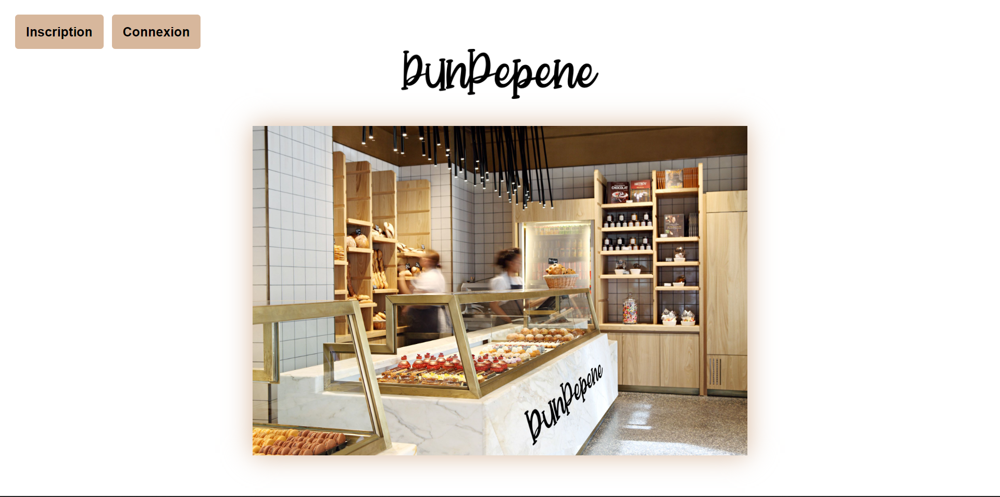
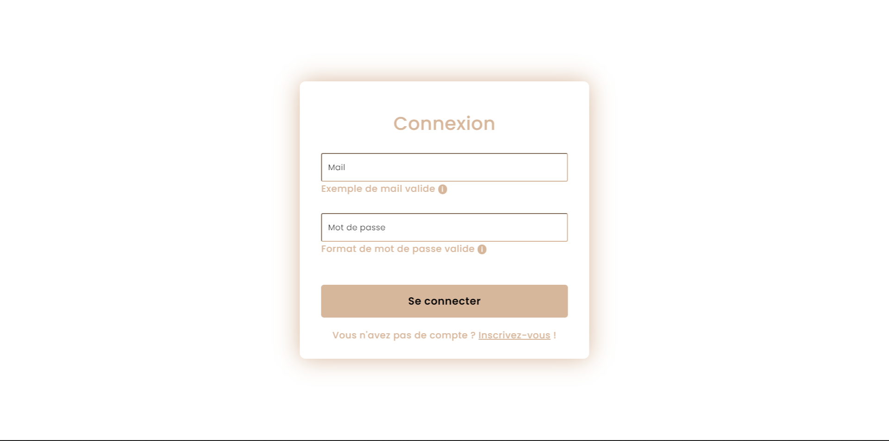
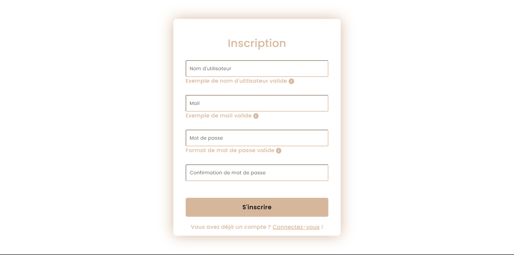
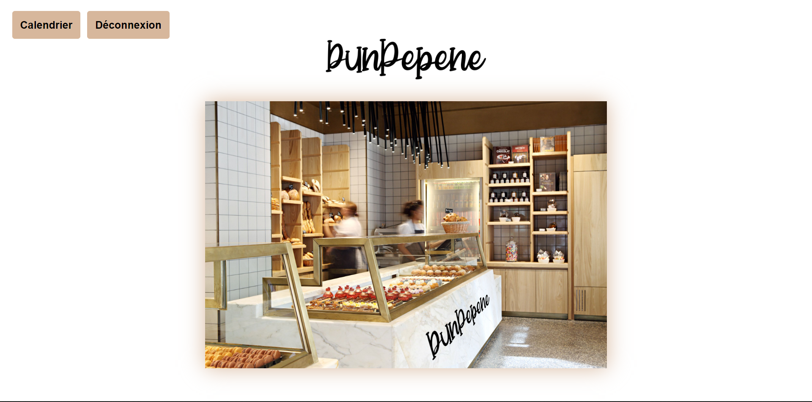
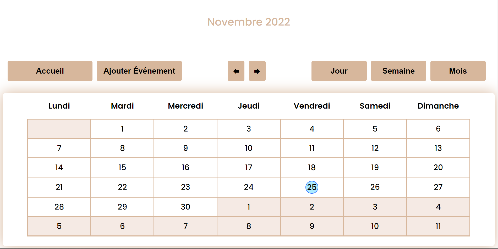
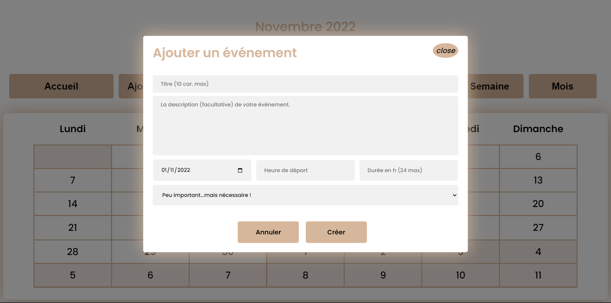
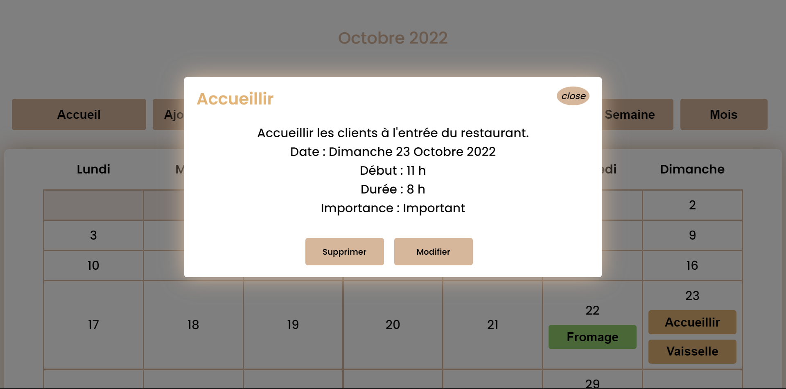
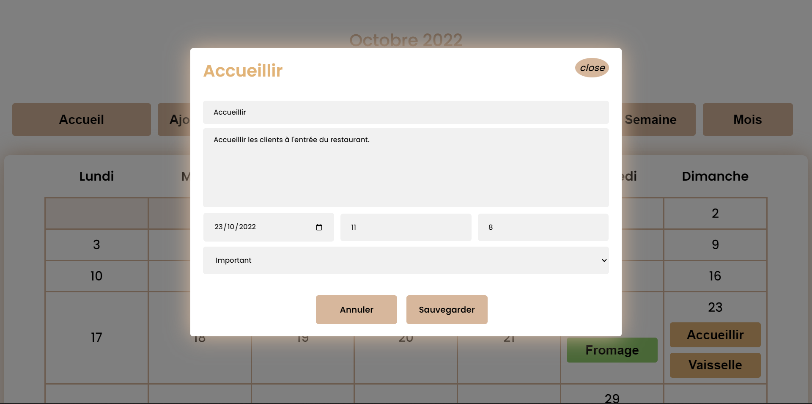
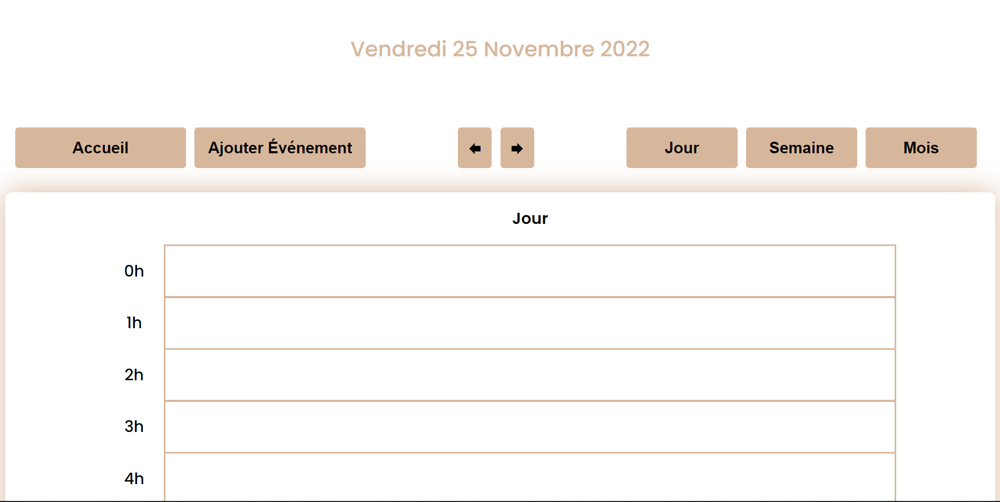
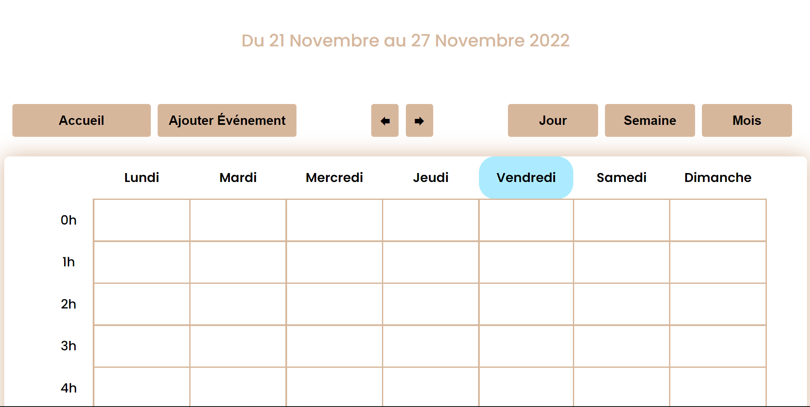

# DunPepene

Projet de Design Patterns de M1.

---
## Équipe
+ IOPETI Hugo
+ YVOZ Ludovic

---
## Démarrage

Première étape, il faut installer les dépendances :
> npm install

Ensuite, pour lancer le serveur, il faut exécuter les commandes suivantes : 
> npm run-script run

Enfin, pour accéder à notre site, il suffit de rechercher dans la barre de recherche : https://localhost:3030/

La documentation de l'API est disponible dans le répertoire du projet (DunPepene_doc.pdf).

Contraintes du sujet : Nous n'utilisons pas de framework, par conséquent, il n'y a donc pas de commandes supplémentaires.

---
## Capture d'écrans

---

